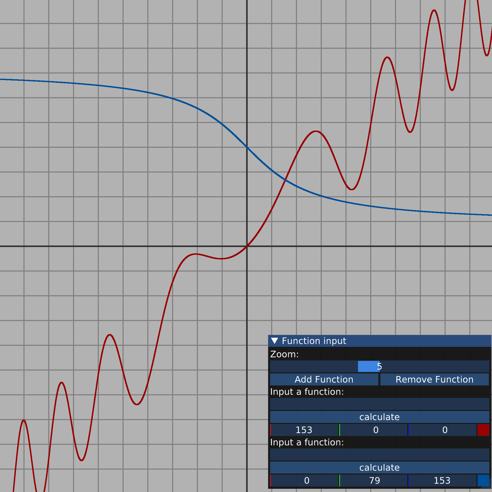

# Graph

Graph is a C++ application that renders mathematical functions using OpenGL.
It supports interactive visualization of functions and a simple GUI for function input.
This project is currently in developement and additionnal features such as functions and axis intersection points calculations are coming.

This is my first OpenGL project which I did for learning graphics programing and software architecture.

Thanks to Victor Gordan and Joey de Vries for their amazing tutorials that helped me learn this stuff.


## Features

- OpenGL-based rendering
- Function plotting (such as x^2, sin(x), sqrt(x) ... )
- Grid and axis rendering
- ImGui-based user interface


## Screenshots




## Build Instructions

This is a Visual Studio build only.
Clone the repo and open it in Visual Studio then build and run it as any other MSVC project.
To be able to build the project you must have\
\
installed from Visual Studio installer.

If the app screen is too large you can change it in
`./src/main.cpp`
The first two `constexpr` are the width and the height in pixels.
```cpp
constexpr unsigned int width = 1900;
constexpr unsigned int height = 1900;
```
Be sure that the two stay the same.

### System Requirements

- C++17 or newer
- OpenGL-capable GPU


### Third-Party Dependencies

The following libraries are used:

- GLFW
- GLAD
- GLM
- ImGui
- stb_image
- exprtk
- FreeType
- DejaVu Fonts

All third-party licenses are listed in
[`THIRD_PARTY_LICENSES.md`](THIRD_PARTY_LICENSES.md).
